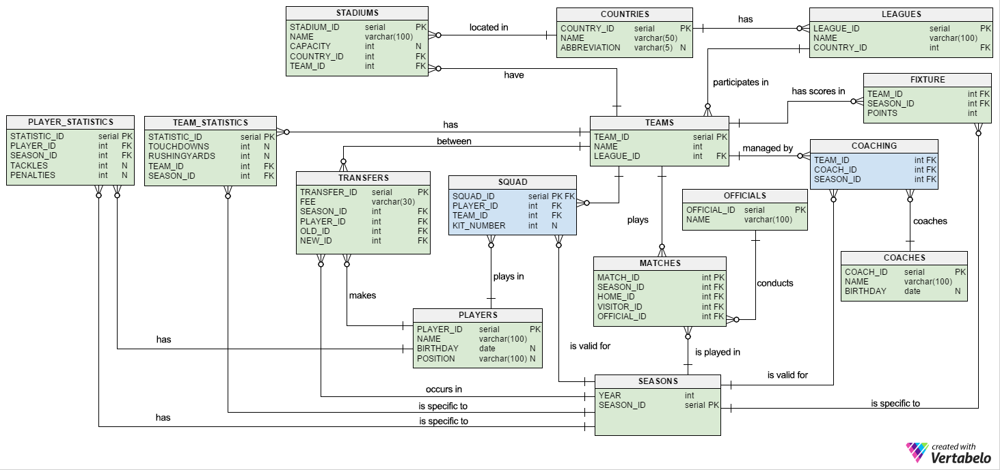

Developer Guide
===============

Database Design
---------------

Main purpose of this database is creating a web application to hold basic information about American Football.

Our database mainly contains information about Teams, Players, Coaches, Matches, Leagues etc.

Teams and Players tables are the most active tables. Tables like Player Statistics, Team Statistics, Transfers, Fixture are designed to keep the relations
between Teams and Players. Teams and Players tables are referenced by other tables alot.

Countries, Players, Officials, and Seasons tables are core tables. These entities do not reference any other table.

PostgreSQL is the relational database management system used in Database Design.

Psycopg2 is used as database adapter.

   ER Relation Diagram of American Football Database

Code
----

Server file has been contributed by all group members.

We first connected our tables' python classes to server:

.. code-block:: python

      if __name__ == '__main__':

          '''Container objects'''

          app.coaches = Coaches2(app)
          app.coaching = Coaching2(app)
          app.teams = Teams(app)
          app.players = Players(app)
          app.countries = Countries(app)
          app.leagues = Leagues(app)
          app.stadiums = Stadiums(app)
          app.officials = Officials(app)
          app.seasons = Seasons2(app)
          app.matches = Matches(app)
          app.statisticsTeam = StatisticsT(app)
          app.statisticsPlayer = StatisticsP(app)
          app.fixtures = Fixtures(app)
          app.squads = Squads(app)
          app.transfers = Transfers(app)

Initilization of all tables is controled by a function in the server.py. At the creation of tables we looked at the relations of tables with each other and created them according to their priority.
We first created core tables, then other tables were created.
As we did not wanted to make it reachable to every user we did not put a button that goes to this address. To reach it user need to write *"/init_db"* to the end of the home page link.
Here is the python code of this function:

.. code-block:: python

      def create_tables():

         '''Reference order in DB should be preserved'''
         app.coaches.initialize_tables()
         app.seasons.initialize_tables()
         app.countries.initialize_tables()
         app.players.initialize_tables()
         app.leagues.initialize_tables()
         app.teams.initialize_tables()
         app.stadiums.initialize_tables()
         app.coaching.initialize_tables()
         app.squads.initialize_tables()

         app.officials.initialize_tables()
         app.matches.initialize_tables()
         app.transfers.initialize_tables()

         app.statisticsTeam.initialize_tables()
         app.statisticsPlayer.initialize_tables()
         app.fixtures.initialize_tables()

         return redirect(url_for('home_page'))

To drop the tables we again write a function at server.py, but this time it does not call any other class. It just scans the database and finds table names in out schema.
Then it drops tables according to those names. Here is the python code:

.. code-block:: python

      def drop_tables():
         with dbapi2.connect(app.config['dsn']) as connection:
                cursor = connection.cursor()
                cursor.execute("""SELECT table_schema,table_name FROM information_schema.tables
                                WHERE table_schema = 'public' ORDER BY table_schema,table_name""")
                rows = cursor.fetchall()
                for row in rows:
                    if row[1]!="pg_stat_statements":
                        cursor.execute("drop table " + row[1] + " cascade")

                connection.commit()
         return redirect(url_for('create_tables'))

.. note:: As ElephantSQL creates a table on its own and we do not have right to delete this table, we skip *"pg_stat_statements"* table.

.. toctree::
   :maxdepth: 4

   member1
   member2
   member3
   member4
   member5